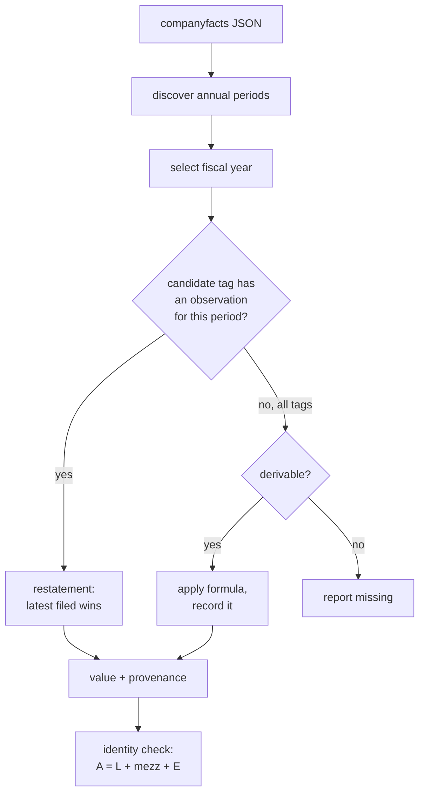

# xbrl-normalize

Turns SEC XBRL company facts into financial statements you can actually compare
across companies.

[](https://github.com/asp53826/xbrl-normalize/actions/workflows/ci.yml)


> Microsoft tags revenue as `RevenueFromContractWithCustomerExcludingAssessedTax`.
> Exxon uses `Revenues`. Microsoft *also* has a `Revenues` tag — it last carried
> a value in 2010. Pick the wrong one and your 2026 revenue figure is off by a
> factor of five.

## The problem

XBRL is standardised in the sense that everyone uses the same dictionary and
nobody uses the same words. Pulling "revenue" for a company means dealing with:

- **Tag choice.** Six different us-gaap tags plausibly carry revenue, and which
  one a filer uses depends on their industry and the era.
- **Staleness.** A tag being present in a company's facts says nothing about
  whether it was used *recently*. The naive "first tag that exists" answers
  Microsoft's FY2026 revenue with a number from 2010.
- **Restatement.** The same fiscal period is reported again in later filings,
  with revisions. There is no "current" flag; you sort by filing date.
- **Omission.** Walmart publishes no `Liabilities` tag at all. AT&T's went stale
  in 2015. Both publish the combined total, so it has to be backed out.
- **Mezzanine equity.** Redeemable noncontrolling interests sit between
  liabilities and equity and are excluded from both, so the balance sheet does
  not close without them.

## What is actually implemented

- nineteen canonical line items across income statement, balance sheet and cash
  flow, each resolved from an ordered list of candidate tags;
- resolution requires an observation *for the requested period*, which is what
  stops stale tags from answering;
- restatements resolved by most-recent filing, with 10-K outranking 10-Q on ties;
- omitted lines derived from accounting relationships, with the formula recorded
  in the output rather than silently blended in;
- fiscal periods discovered from the union of every annual-length duration, so
  52/53-week retail calendars and non-December year ends work;
- every value carries provenance: which tag, direct or derived, filed when;
- unresolvable lines are reported as missing, never as zero.



## Measured, not implied

102 companies spread across banks, insurers, energy, retail, pharma,
industrials, utilities and tech — a tech-only sample would flatter these
numbers badly. Reproduce with `make bench`.

| Line item | Coverage | Direct | Derived |
|---|---:|---:|---:|
| Net income | **100.0%** | 102 | 0 |
| Total assets | **100.0%** | 102 | 0 |
| Total liabilities | **100.0%** | 71 | **31** |
| Total equity incl. NCI | **100.0%** | 102 | 0 |
| Operating / investing / financing cash flow | **100.0%** | 102 | 0 |
| Cash and equivalents | 99.0% | 101 | 0 |
| Revenue | 94.1% | 96 | 0 |
| Equity attributable to parent | 92.2% | 94 | 0 |
| Current assets / liabilities | 79.4% | 81 | 0 |
| Capital expenditure | 79.4% | 81 | 0 |
| Operating income | 66.7% | 68 | 0 |
| Gross profit | 51.0% | 23 | 29 |

Total liabilities reaches 100% only because 31 of 102 filers don't tag it and it
gets derived.

**Which tag answered "revenue":**

| Count | Tag |
|---:|---|
| 55 | `Revenues` |
| 37 | `RevenueFromContractWithCustomerExcludingAssessedTax` |
| 4 | `RevenueFromContractWithCustomerIncludingAssessedTax` |

No single tag covers even 55% of a large-cap sample. This is the whole problem.

**Accounting identity** (`assets = liabilities + mezzanine + equity`) as a
correctness oracle — it is not an input to normalisation, so it independently
checks whether the result is coherent:

| Result | Share |
|---|---:|
| Checkable | **100.0%** (102/102) |
| Exact (< 1e-9) | **96.1%** |
| Within 0.01% | 2.0% |
| Off by more | 2.0% |

The two failures are BlackRock (3.19%) and AEP (0.03%). Neither gap is explained
by any single instant tag in their own filings — these are filer-side
inconsistencies, and the library reports them rather than forcing a balance.

## Where it loses

- **Banks lose the income statement.** Wells Fargo, Morgan Stanley, Goldman and
  Truist resolve no revenue at all, because they present net interest income
  plus noninterest revenue and never tag a top-line total. The coverage numbers
  above are dragged down almost entirely by financials, and that is the honest
  picture — a `revenue` line for a bank would be an invention.
- **No classified balance sheet for financials.** Current assets and current
  liabilities sit at 79.4% because banks and insurers don't present them. Not a
  gap in the mapping; a gap in the concept.
- **Operating income at 66.7%.** Many filers never tag `OperatingIncomeLoss`.
  Pre-tax income is available and tempting, but it isn't the same concept, so
  it's left missing rather than mapped to something adjacent.
- **Consolidated totals only.** Segment and geographic breakdowns exist in the
  facts under dimensional axes; this ignores them entirely.
- **Ticker → CIK follows the current registrant.** After a reorganisation that
  can be a brand-new CIK with empty facts — `XOM` now points at CIK 2115436,
  whose companyfacts is essentially empty, while the history lives under 34088.
  This raises `NoAnnualData` rather than reporting every line missing, but it
  cannot find the predecessor for you.
- **Annual only.** Quarterly periods are detected and deliberately excluded; Q4
  is usually not tagged directly and would have to be derived as the full year
  minus the first three quarters.

## Verify it

```bash
make test    # 25 tests, no network
make bench   # 102 companies against live EDGAR
```

## Use it

SEC requires a User-Agent with a real contact address and blocks requests
without one.

```bash
export EDGAR_USER_AGENT="your-project you@example.com"
uv run xbrl-normalize WMT
```

```
WALMART INC.  (CIK 104169)
FY2026 ending 2026-01-31

  BALANCE
    Total assets                            284,668M
    Total liabilities                       178,488M  [liabilities_and_equity - equity - temporary_equity]
    Total equity incl. NCI                  105,887M
    Temporary (mezzanine) equity                293M

  assets = liabilities + equity: balances
```

`--json` emits every value with its provenance; `--fy 2023` selects a year.

```python
from xbrl_normalize.fetch import Fetcher
from xbrl_normalize.normalize import normalize

async with Fetcher() as f:
    st = normalize(await f.company_facts(104169))

st.get("revenue")                    # 713_163_000_000.0
st.values["liabilities"].method      # "derived"
st.identity_error()                  # 0.0
st.missing                           # lines that could not be resolved
```

## License

MIT
